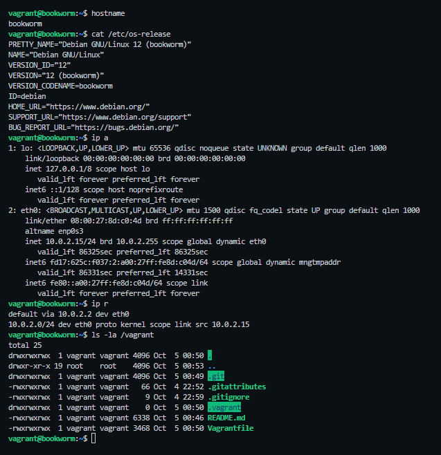
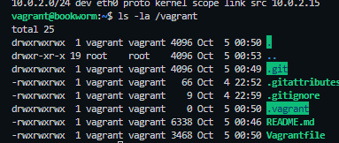
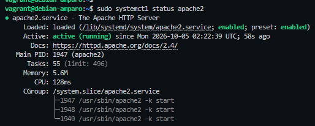
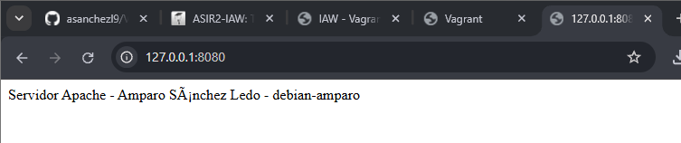
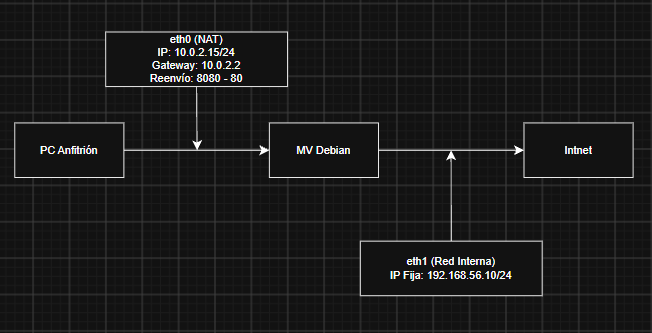

# **Tarea 1.1.2 - Vagrant**
##### _Amparo Sánchez Ledo - ASIR 2 - 02/10/2026_

> Antes de comenzar, debemos saber que (según la documentación oficial) **Vagrant** es una herramienta para _construir y gestionar entornos de máquinas virtuales en un único flujo de trabajo_. Como detalle, el trabajo se ha realizado con el uso de VSCode (subiendo los archivos a GitHub, la creación del README.md, los comandos de Vagrant...) y con VirtualBox.


## **_Punto A. Investiga antes de modificar el entorno_**

#### **_1. Vagrant y el Vagrantfile_**

- **_¿Qué problema resuelve Vagrant?_**
    - En una situación real de trabajo, el configurar servidores a mano puede provocar _errores u olvidos_ si otra persona intenta replicarlo en otro PC, pero gracias a Vagrant (que permite describir el entorno en archivos de texto que se guardan en Git) aseguras que todos tengan exactamente la _misma máquina y configuraciones_, de manera que permite _borrarla y recrearla de cero en cuestión de minutos_.
  
- **_Distinción de elementos_**
    - **Anfitrión:** _Ordenador físico_ donde instalas todo.
    - **Proveedor de virtualización:** _Programa que crea y ejecuta las máquinas virtuales_, de manera que Vagrant únicamente le da órdenes.
    - **Box:** _Plantilla o imagen base preinstalada del sistema operativo_ (en este caso, Debian 12) que Vagrant descarga y clona para no tener que instalar de cero con una ISO.
    - **Máquina virtual:** _Servidor virtual_ que ya está corriendo dentro del proveedor a partir de esa box.

- **_Lenguaje de Vagrantfile_**
    - El lenguaje en el que está escrito el Vagrantfile es _Ruby_, pero solo con asignaciones básicas de manera que no es necesario saber programar en él.


#### **_Punto 2. Aprovisionamiento_**

- **_¿Qué es un provisioner?_**
    - Herramienta de Vagrant que _automatiza la instalación de programas y la configuración del sistema_ para no hacerlo a mano al encender la máquina.

- **_¿Dónde se ejecuta el script?_**
    - Se ejecuta _dentro de la máquina virtual_ (usando permisos de _root_).

- **_¿Cuándo lanza Vagrant el script?_**
    - _Por defecto_, lo lanza solo la primera vez que ejecutas _vagrant up_ al crear la máquina.

- **_Diferencia entre inline: y path:_**
    - **inline:** Escribes los comandos directamente metidos dentro del propio _Vagrantfile_.
    - **path:** Le indicas la _ruta_ a un archivo de script externo guardado en tu carpeta.

- **_¿Qué ocurre si modificas el script después del primer vagrant up y cómo lo ejecutas de nuevo?_**
    - Si lo editas después, no se ejecuta solo al arrancar la máquina. Para forzar que se ejecute de nuevo, tienes que lanzar el comando _vagrant provision_ (con la máquina encendida) o _vagrant reload --provision_ (si quieres reiniciarla).


#### **_Punto 3. Interfaces y redes_**

- **_¿Qué conexión de red configura Vagrant por defecto y para qué la utiliza?_**
    - Configura siempre la primera tarjeta en modo _NAT_. La usa obligatoriamente para conectarse por SSH a la máquina virtual y para darle salida a Internet.

- **_¿Cómo se añade en el Vagrantfile una segunda interfaz con dirección IP fija?_**
    - Añadiendo la línea `config.vm.network "private_network", ip: "192.168.56.10"`.

- **_Comparativa de redes (con quién se comunica la máquina en cada caso)_**
    - **NAT:** Se comunica hacia _Internet_, pero nadie desde fuera puede iniciar conexión hacia la máquina.
    - **Red interna:** Solo _máquinas virtuales entre sí dentro de una red aislada_. No tienen Internet y el _ordenador anfitrión_ no puede comunicarse con ellas.
    - **Red privada host-only:** Se comunican las _máquinas virtuales entre sí_ y también con el _ordenador anfitrión_ (tiene tarjeta virtual en esa red), pero sin salida a Internet.
    - **Red pública:** La máquina se conecta directamente al router real como un ordenador físico más, comunicándose con toda la red local.

- **_¿Qué función cumple el reenvío de puertos?_**
    - _Conecta un puerto del PC anfitrión con uno de la máquina virtual_ para poder acceder a servicios internos a través de la red NAT.

- **_¿Añadir la segunda interfaz elimina la NAT predeterminada?_**
    - No, Vagrant mantiene siempre la NAT en la primera interfaz y crea la nueva red como un segundo adaptador extra.

- **_¿El reenvío de puertos crea una interfaz nueva?_**
    - No, aplica una regla de redirección sobre la primera interfaz NAT que ya existe.


#### **_Punto 4. Órdenes y carpeta compartida_**
| **Orden** | **Uso** | **Ejecución** |
| --- | --- | --- |
| _up_ | Crear la máquina por primera vez o encenderla si estaba apagada | Sí |
| _status_ | Comprobar si la máquina está encendida, apagada o sin crear | Sí |
| _ssh_ | Administrar o comprobar el sistema desde la terminal de Debian | Sí |
| _reload_ | Reiniciar la máquina para aplicar cambios realizados | Sí |
| _provision_ | Ejecutar el script bash sin tener que apagar ni reiniciar la máquina | Sí |
| _halt_ | Apagar la máquina sin borrarla | Sí |
| _destroy_ | Eliminar la máquina por completo del disco para empezar de cero | No |

- **_¿Qué es /vagrant?_**
    - Carpeta dentro de la máquina Debian que está sincronizada en tiempo real con la carpeta del proyecto del PC anfitrión (donde se encuentra el Vagrantfile), permitiendo compartir archivos entre ambos automáticamente.
    Al ejecutar un `ls -la /vagrant` para listar su contenido, aparecen reflejados los archivos del repositorio del anfitrión:

    

---

## **_Punto B. Mi primera máquina en Vagrant_**

**_Para la inicialización y arranque:_**

Se generó el archivo inicial con el uso del comando _vagrant init debian/bookworm64_; seguidamente, se verificó su sintaxis usando _vagrant validate_ y se levantó la máquina en VirtualBox con _vagrant up_, accediendo a ella con _vagrant ssh_.

**_Observaciones:_**

- **Hostname:** El nombre inicial asignado por la box es _bookworm_.

- **Sistema operativo:** _Debian GNU/Linux 12 (bookworm)_.

- **Interfaces (ip a):** Dispone de _loopback (127.0.0.1/8)_ y la _interfaz principal eth0_ en modo NAT con la IP _10.0.2.15/24_.

- **Rutas (ip r):** Su ruta por defecto hacia el exterior (_default_) apunta a la puerta de enlace _10.0.2.2_ a través de _eth0_.



---

## **_Punto C. Completa el Vagrantfile_**

Se han realizado ciertas modificaciones en el _Vagrantfile_:

- **Imagen base:** `config.vm.box = "debian/bookworm64"` (se mantiene igual)

- **Nombre de la máquina (hostname):** `config.vm.hostname = "debian-amparo"` (línea añadida)

- **Reenvío de puertos:** `config.vm.network "forwarded_port", guest: 80, host: 8080, host_ip: "127.0.0.1"` (línea configurada para escuchar únicamente en `127.0.0.1`)

- **Segunda interfaz de red:** `config.vm.network "private_network", ip: "192.168.56.10", virtualbox__intnet: true` (para añadir un segundo adaptador con IP fija en red interna)

- **Script de aprovisionamiento:** `config.vm.provision "shell", path: "provision.sh"` (línea añadida para vincular el script Bash)

Una vez hechos y guardados los cambios en el _Vagrantfile_, creamos el archivo _provision.sh_, validamos el _Vagrantfile_ con _vagrant validate_ y reiniciamos la máquina con _vagrant reload_ para que se aplique la configuración.

**_Comprobación de cambios:_**

> Volvemos a acceder con _vagrant ssh_

- **Hostname nuevo:** Ejecutando _hostname_ podemos ver que el nombre ha cambiado a _debian-amparo_.

- **Interfaces (ip a):** Comprobamos que se conserva la primera interfaz NAT _eth0_ con la dirección _10.0.2.15/24_ (además de quedar declarada la segunda interfaz con IP fija _192.168.56.10/24_ en el _Vagrantfile_).

- **Rutas (ip r):** Se verifica que la salida por defecto de la NAT se mantiene por _default via 10.0.2.2 dev eth0_ y la red local _10.0.2.0/24 dev eth0_.

- **Diferencia entre red interna y host-only:** En la _red interna_ (VirtualBox) solo se comunican las máquinas virtuales entre sí dentro de una red aislada sin acceso desde el anfitrión; mientras que en _host-only_ (VMware) se crea un adaptador virtual en el equipo físico que permite la comunicación directa entre el anfitrión y la máquina virtual.

- **Script de aprovisionamiento (provision.sh):** Creamos el archivo _provision.sh_ en la raíz del repositorio para que _vagrant reload_ valide la ruta configurada y, al entrar por SSH, comprobamos con _ls -la /vagrant_ que el script ya aparece sincronizado dentro de la máquina.



> **Nota:** En caso de que al iniciar o recargar Vagrant en Windows no deje acceder por un error del controlador `hostonlyif` de VirtualBox, se puede comentar temporalmente la línea `config.vm.network "private_network", ip: "192.168.56.10", virtualbox__intnet: true` poniendo una `#` delante.

---

## **_Punto D. Aprovisiona Apache_**

Para poder automatizar la instalación del servidor web, se ha editado el script de _provision.sh_ de la siguiente manera:

```
#!/bin/bash
apt update
apt install -y apache2
systemctl enable apache2
systemctl start apache2
echo "Servidor Apache - Amparo Sánchez Ledo - debian-amparo" > /var/www/html/index.html
```

Desglosemos el script:
- **#!/bin/bash:** indica al sistema que el archivo debe ejecutarse con Bash

- **apt update:** actualiza la lista de paquetes disponibles.

- **apt install -y apache2:** instala el paquete del servidor web Apache (el _-y_ es para confirmar automáticamente)

- **systemctl enable apache2:** habilita el servicio para que arranque solo al encender la máquina.

- **systemctl start apache2:** inicia el servicio.

- **echo "..." > /var/www/html/index.html:** sobreescribe el mensaje por defecto, cambiándolo por el que queramos poner.

**_Reejecución del aprovisionamiento y prueba:_**

Tras haber modificado el mensaje, para volver a ejecutar solo el aprovisionamiento se usa el comando _vagrant provision_ desde la terminal. Seguidamente, entramos por SSH con _vagrant ssh_ y ejecutamos _sudo systemctl status apache2_ para comprobar que el servicio esté activo.



Una vez ya está encendido, accedemos desde el navegador del anfitrión a la siguiente URL:

```http://127.0.0.1:8080```

Y comprobamos que el reenvío de puertos funciona y muestra el mensaje que hemos escrito:



**_Esquema de red y análisis del Vagrantfile final_**

El esquema de red de esta práctica ha quedado de la siguiente manera:



Y el archivo Vagrantfile (sin los comentarios que trae por defecto) queda de la siguiente manera:

```
Vagrant.configure("2") do |config|
  config.vm.box = "debian/bookworm64"
  config.vm.hostname = "debian-amparo"
  config.vm.network "forwarded_port", guest: 80, host: 8080, host_ip: "127.0.0.1"
  config.vm.network "private_network", ip: "192.168.56.10", virtualbox__intnet: true
  config.vm.provision "shell", path: "provision.sh"
end
```

> Y ya con esto se ha finalizado la tarea, en la cual hemos aprendido a levantar una máquina Debian en __VirtualBox__ desde código de __VSCode__ con __Vagrant__, configurar sus tarjetas de red y el reenvío de puertos en el __Vagrantfile__, y automatizar la instalación de un __servidor web Apache__ mediante un script. A continuación, las fuentes consultadas:

---

## **_Fuentes consultadas_**
- [Documentación oficial de Vagrant: Introducción](https://developer.hashicorp.com/vagrant/intro)
- [Documentación oficial de Vagrant: Vagrantfile](https://developer.hashicorp.com/vagrant/docs/vagrantfile)
- [Documentación oficial de Vagrant: Redes](https://developer.hashicorp.com/vagrant/docs/networking)
- [Documentación oficial de Vagrant: Red privada](https://developer.hashicorp.com/vagrant/docs/networking/private_network)
- [Documentación oficial de Vagrant: Redes en VirtualBox](https://developer.hashicorp.com/vagrant/docs/providers/virtualbox/networking)
- [Documentación oficial de Vagrant: Puertos reenviados](https://developer.hashicorp.com/vagrant/docs/networking/forwarded_ports)
- [Documentación oficial de Vagrant: Aprovisionamiento con Bash (Shell)](https://developer.hashicorp.com/vagrant/docs/provisioning/shell)
- Apuntes y material del curso en Moodle.